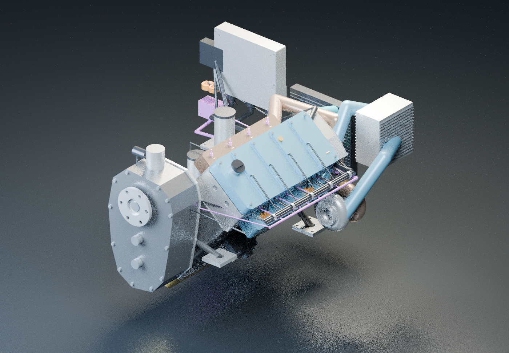

# AeroTrace — SIH 2026

AE300 engine-health **research prototype** with an interactive CAD reconstruction, synthetic replay, anomaly evidence and fault-injection experiments.



## What is included

| Folder | Contents |
| --- | --- |
| `public-demo/` | Synthetic-only website, six precomputed fault scenarios, RPM-linked animation, illustrative vibration and thermal bench. No uploads or live backend. |
| `desktop/` | Redesigned React/Three.js UI, local CSV analysis, configurable fault injection, Electron shell and loopback preview. |
| `backend/` | Python API, telemetry validation, reduced-order physics, contextual anomaly model, reference model JSON and tests. |
| `cad/ae300_v4/` | Parametric R4 CAD generation and kinematics source. |
| `cad/models/` | Editable Blender assembly and compressed full STEP assembly. |
| `cad/docs/` | Dimensions, sensor mapping, bill of materials, design notes and previous validation records. |
| `scripts/` | Restore CAD assets and serve the static demo locally. |

## Quick start: public synthetic demo

Prerequisites: **Node.js 22.18+** and **pnpm**. No Python service or credentials are needed for this edition.

```powershell
cd public-demo
pnpm install --frozen-lockfile
pnpm run build
pnpm test
pnpm start
```

Open **http://127.0.0.1:8011/**. Press **Play** to animate, switch to **Cutaway** to inspect the mechanism, or load a fault demonstration. The vibration panel has an on/off switch, roughness and visual magnification. Its case motion is illustrative, not measured vibration.

The build creates `public-demo/dist/`, which can be served by a static web host. It does not require the private backend. Publication itself is not part of this source handoff.

## Full local backend and dashboard

Prerequisites: **Python 3.12**, Node.js and pnpm. Run from the repository root:

```powershell
python -m venv .venv
& ./.venv/Scripts/python.exe -m pip install -r backend/requirements-lock.txt
& ./.venv/Scripts/python.exe -m pip install -e './backend[test]'
cd desktop
pnpm install --frozen-lockfile
pnpm run build
& ../.venv/Scripts/python.exe scripts/preview_host.py
```

Open **http://127.0.0.1:8010/**. Keep this service bound to localhost: the developer preview is not a public server. Logs and runtime databases are created locally and are ignored by Git.

`desktop` build and test commands automatically restore the compressed engine model. The source preview does not require a working EXE installer. Windows packaging remains unvalidated and previously encountered Application Control blocks; see [desktop validation](desktop/VALIDATION.md). No EXE is included or claimed release-ready.

## CAD files

- Open `cad/models/AE300_R4_Functional.blend` in Blender for the editable animated scene.
- Run `node scripts/prepare-cad.cjs --step` from the root to restore `cad/models/AE300_R4_Assembly.step` and the desktop GLB.
- The compressed GLB in `public-demo/public/engine.glb.gz` is the same 619-solid reconstruction used by the UI.
- CAD source and modelling assumptions are in [cad/ae300_v4](cad/ae300_v4/README.md) and [design notes](cad/docs/DESIGN_NOTES.md).

The restored STEP and GLB are ignored; keep their smaller compressed originals in Git.

## Tests

```powershell
# Repository root, after backend installation
& ./.venv/Scripts/python.exe -m pytest backend/tests desktop/tests -q
cd desktop
pnpm test
# Separately, after building public-demo
cd ../public-demo
pnpm test
```

The optional upstream real-data integration test skips if the separately downloaded public example dataset is absent. No original flight logs are included.

## Research limitations

This is not an OEM manufacturing definition, calibrated engine-failure simulator, certified digital twin or maintenance tool. The anomaly model uses unlabelled public reference examples; it cannot establish engine health or confirm fault diagnoses. No validated remaining useful life, failure probability or airworthiness assessment is provided.

Vibration magnitude and roughness are manually selected teaching effects. Motion is magnified and slowed explicitly; the project does not contain accelerometer measurements. Engine rotation remains tied to derived crank RPM at the selected playback scale. The public fault scenarios are precomputed signal perturbations, not live online model training or coupled failure dynamics.

## Push this folder to GitHub

Use **this folder as the repository root**, not the original `C:/aerotrace` workspace. It contains no old Git history, hosting-account configuration, local databases, private logs, virtual environments, installers or dependency caches.

Using GitHub Desktop, create a repository from this folder and choose **Publish repository**. Alternatively, initialise Git here, commit the folder contents, connect your own empty repository and push `main`. Do not commit the handoff ZIP itself.

All supplied files are below GitHub's 25 MiB browser-upload limit. Generated uncompressed CAD files are ignored. See [GitHub file-size guidance](https://docs.github.com/en/repositories/working-with-files/managing-large-files/about-large-files-on-github).

## Attribution and licensing

See [THIRD_PARTY_NOTICES.md](THIRD_PARTY_NOTICES.md). No project-wide open-source licence has been chosen on your behalf. Select an appropriate licence before offering reuse rights; retain upstream dependency notices. Manufacturer manuals are referenced, not redistributed.
